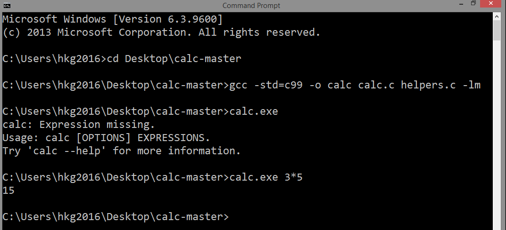

# Calculator CalC
This is a simple console app calculator
that supports most of the functions that one can 
find in a scientific calculator.



***
Furthermore, to demonstrate creating GUI in
another language that will communicate
with this program, Mong Alvarez Jr. decided
to use PureBasic for the GUI. But there is so much to
be done yet. Mong Alvarez Jr. does not have
enough time to finish this (as always). 
This is just the initial effort.


***
In component-based approach, software developers
need only to know the behavior of a component
and how they would interact with that component. 
One good example is Java Bean.

But here, the only interface is the command line argument
and that is enough so that PureBasic can
interact with this program. But C and PureBasic
were not meant for component-based build, yet
in situations like this, software
developers can agree on how each component should
communicate with one another. 

## Compile and Create Executables
Compile with,
  
	gcc -std=c99 -o calc calc.c helpers.c -lm

Run with,
  
	./calc [OPTIONS] <EXPRESSION>...

or in Windows OS,

	calc.exe [OPTIONS] <EXPRESSION>...

Obviously, the expressions are expected to be quoted 
within single quotation marks to prevent bash/shell from parsing them.

In Windows OS, you can just type the arguments without space/s
to be interpreted as single expression or can be inside
double quotation marks.

### PureBasic Compile and Create Executable
As usual, in PureBasic, it is very easy to compile
the `calc.pb` using the PureBasic IDE. 

The compiled file of `calc.pb` used an icon that is
included here. This is the favorite icon of Mong
Alvarez Jr. that he created 
and is the icon being used for his apps:


### Dist Folder
There is the `dist_beta_ver` folder. This folder contains
the executable files `calc.exe` and `calcGUI.exe` for
Windows.

`calc.exe` is the original console program
while `calcGUI.exe` is the attempt
to provide GUI for CalC program.

## Options
The following flags can be used:

1. `-d`, consider all angles to be degrees. Results are also in degrees.
2. `-n`, print results of each expressions in a new 
line instead of separating them by `;`.
3. `-h` (or) `--help`, print help and exit.

## Expressions
CalC supports multiple expressions in a single call. 

For example,
  
    ./calc '3.4' 'atan(1/0) - 3.14159265358979323846 * sqrt 3'
  
The result of each expression is printed either in the same line 
separated by semicolons or in separate lines if the `-n` flag is used.
  
For example, the output of the above is:
  
    3.4;-3.870601766
  
with `-n` flag,
  
    3.4
    -3.870601766

## Features
### Operators
The following operators are supported:

    + --> addition
    - --> subtraction
    * --> multiplication
    / --> division
    % --> modulo
    ! --> factorial
    ^ --> exponent

Unary `+` and `-` are also supported. `~` and `_`
operators act as 
aliases for unary `-` and `+`, respectively.

The `$` (dollar) operator can be used to refer 
to the result of a particular 
sub-expression. Sub-expression are created 
using the `,` (comma) operator. For example,

    ./calc '7 - 5, sin$1, log($1 - -$2)'

The expression has three sub-expression.

    $1 = 7 - 5
    $2 = sin$1 = sin(7 - 5)
    $3 = log($1 - -$2) = log(7 - 5 - -sin(7 - 5))

The results of all three expressions is printed 
in comma-separated format.

    2,0.9092974268,0.4637881228

### Functions
The following functions are supported:
 
```
sin, cos, tan, asin, acos, atan, sinh, cosh, tanh, asinh, acosh, atanh, log (base 10), ln (base e), exp (e raised), floor, ceil, round, sqrt, abs, sgn
```
 
`sgn` returns 1 if positive, -1 if negative else 0.
  
Trignometric function may have infinite precision related issues. 

For example,
  
    ./calc 'sin pi' 'cos pi'
  
results in,
  
    7.338823075E-05;-0.9999999973
  
The actual values being 0 and -1. `pi` here 
is a symbolic constant.

### Symbolic Constants
The following symbolic constants are supported:
  
    pi    -->  3.14159265358979323846
    e     -->  2.7182818284590452354
    g     -->  1.6180339887498948482
    inf   -->  infinity
    rand  -->  random double in the range (0, 1). (ironic, i know...)
  
For example,
  
    ./calc 'atan inf' 'rand, sin $1, cos($2 - $1)' '-+_+_++_--~---~+_rand'

will result to:
    
    1.570796327;0.4473471527,0.4325752577,0.9998908975;0.6601152609

## TO DO
1. add support for complex numbers
2. add implicit multiplication: 
`(sin 3 cos 4 --> sin 3 * cos 4` or 
`(9 - 4) (sin 3) --> (9 - 4) * (sin 3))`
3. add symbolic mathematics

***
For the GUI written in PureBasic:

- complete the necessary GUI rendering for all
the features from the original CalC program
particularly the scientific calculator

- create an algorithm so that measuring and 
adjusting the buttons and panels would be easy enough

Take note, Mong is determined to do all these things,
but he is always busy.

## LICENSE
CalC was originally licensed under MIT by Vivek Kannan.
The copy of that license is retained at this repo.

Also, Mong Alvarez Jr. licensed this repo under MIT.
